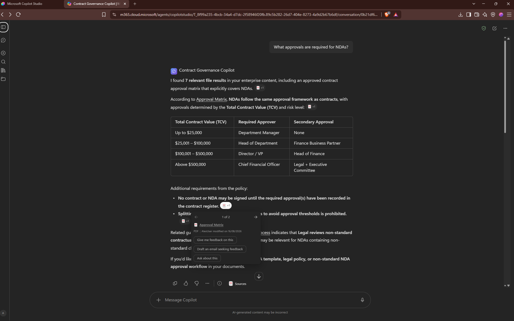
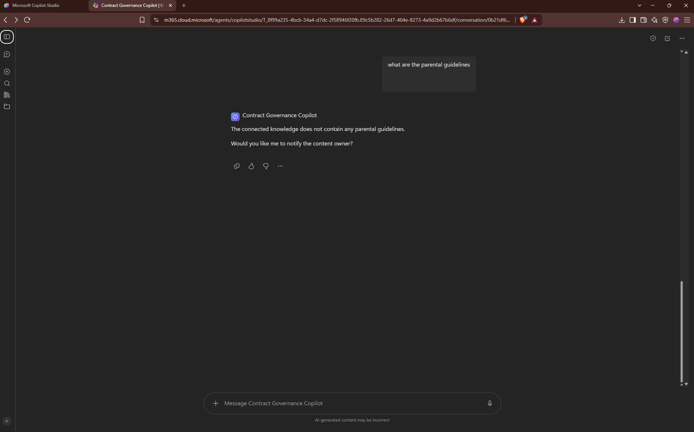
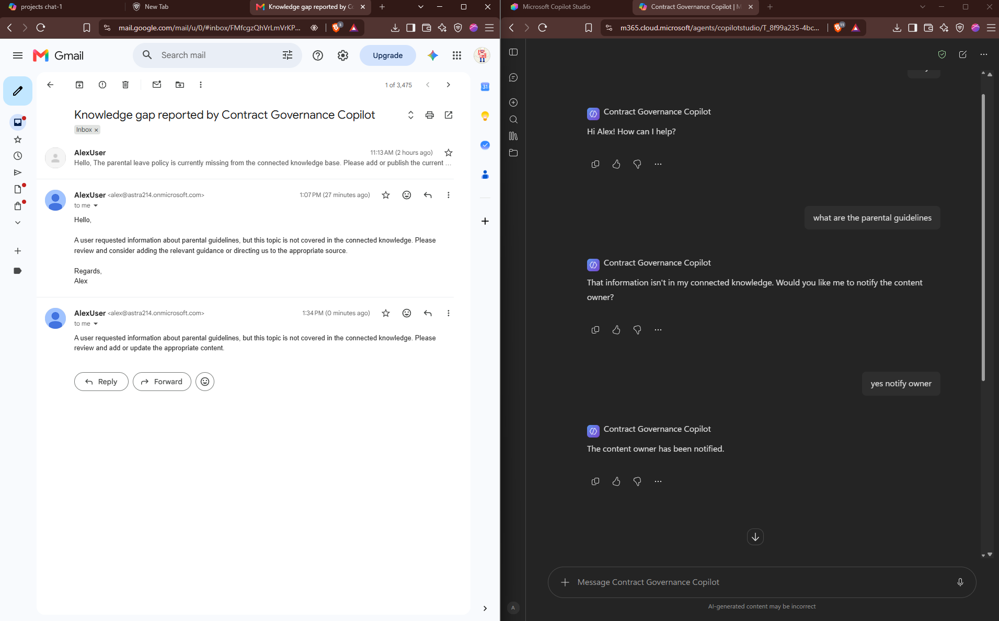
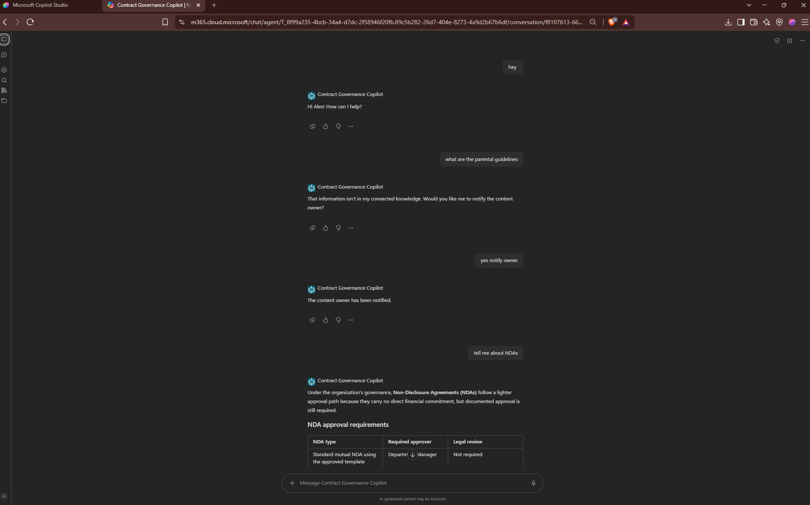
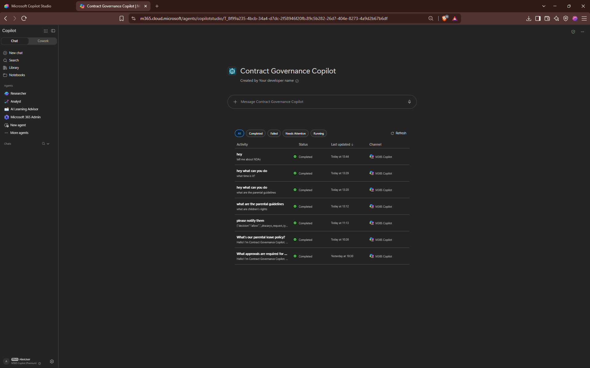
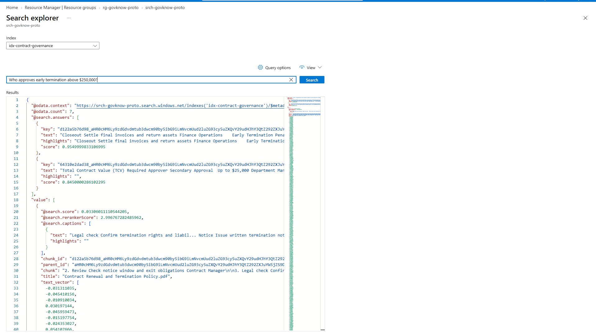
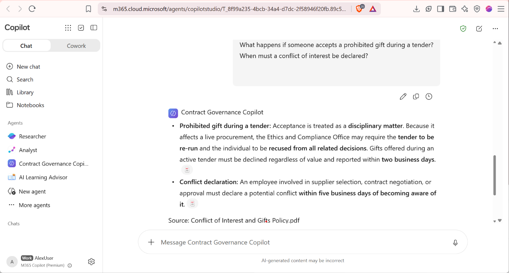

# Demo Evidence — Contract Governance Copilot

Screenshots proving each MVP success criterion. Save the images into `docs/images/`
using the filenames below and these links will render on GitHub.

---

## 1. Grounded answer with citation
The agent answers from an approved document and cites the source PDF.

**Proves:** grounded answers + citations.

---

## 2. Out-of-domain refusal + escalation offer
Asked for "parental leave policy" (not in scope), the agent declines, states what it
does cover, and offers to notify the content owner.

**Proves:** governed refusal (no hallucination) + human-in-the-loop escalation.

---

## 3. Escalation email actually delivered ⭐
The "Notify content owner" action sent a real email naming the missing topic.

- Subject: *Knowledge gap reported by Contract Governance Copilot*
- From: agent-owner@example.com
- Body correctly named the missing topic and requested the owner add/link the source.

**Proves:** the escalation action performs a real, verifiable action.

---

## 4. Grounding enforced — no general-knowledge leak
Asked an out-of-domain general-knowledge question ("What's the capital of Africa?"),
the agent refuses instead of answering from the model's own training data, and offers
to notify the content owner.

**Proves:** the agent answers only from connected knowledge and does not leak
general-knowledge answers (strict grounding + Moderation High).

---

## 5. Published to Teams + Microsoft 365 ⭐
The agent appears in the M365 Copilot agent store with an "Add" button.

**Proves:** delivered in the target channel (Teams + Microsoft 365).

---

## 6. Automated ingestion — Blob → indexer → searchable, no manual upload
The Azure AI Search indexer was moved off manual-trigger onto an hourly incremental
schedule (`PT1H`). A new document was dropped into Blob Storage and indexed
automatically — `itemsProcessed: 1, itemsFailed: 0, status: success` — confirming only
the new file was picked up, not a full reindex.

**Proves:** ingestion is scheduled, incremental and automatic at the retrieval layer —
new documents become searchable with no human step.

---

## 7. Dynamic knowledge — new document answerable without touching the agent
A 7th governance document was added to the SharePoint library only. No file was
uploaded to the agent and the agent was not republished for ingestion purposes.
The agent answers from it and cites it.

**Proves:** knowledge ingestion is dynamic and scalable — the direct response to the
review finding that manual upload does not scale.

---

## Summary

| # | Evidence | Criterion |
|---|----------|-----------|
| 1 | Cited answer | Grounded answers + citations |
| 2 | Refusal + escalation offer | Governed refusal + human escalation |
| 3 | Email received | Escalation performs a real action |
| 4 | Grounding refusal | No general-knowledge leak |
| 5 | Agent-store Add | Teams / M365 delivery |
| 6 | Auto-ingestion (indexer) | Scheduled, incremental ingestion |
| 7 | SharePoint scale test | Dynamic, scalable knowledge |
